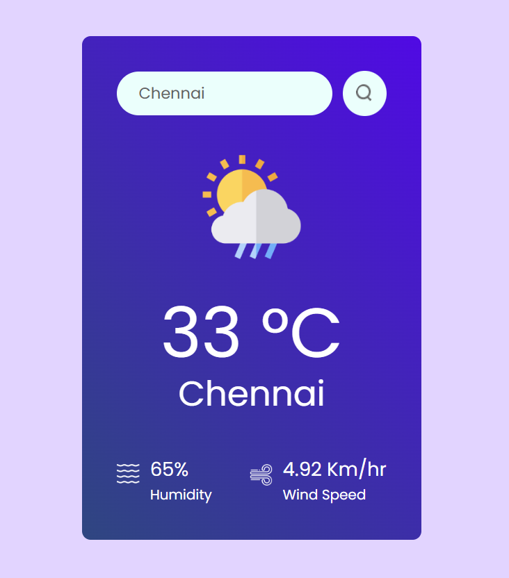

# Weather App using React JS
This web-application can be used to find the climatic conditions of various cities among the world.
<br>
The weather will be updated automatically because the raw data has been fetched from a Application Programming Interface (API).

## User Interface of the web-app


## How to use this app
- Clone this repository in your local machine
- Make sure that you have pre-installed React 
- Open the terminal and type the following command 
 ```
 npm run dev
 ```
- Click on the url displayed on your terminal
- The weather app will be displayed on your default web-browser!
